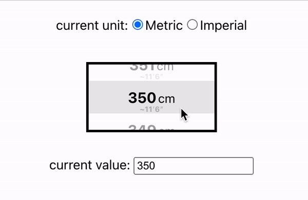

# react-length-picker 📏

[](https://www.npmjs.com/package/react-length-picker)

A simple length picker that works with metric and imperial units

## Teaser



[(YouTube Teaser here)](https://youtube.com/shorts/hfGCPGMwaUc?feature=share)

## Live Demo

https://stackblitz.com/edit/react-length-picker-demo

## Install

```
npm install --save react-length-picker
```

Or if you use Yarn:

```
yarn add react-length-picker
```

## Usage

```tsx
import { LengthPicker } from "react-length-picker";

// ...

return (
  <SomeReactComponent>
    <LengthPicker
      unit={"metric"} // set current unit (metric vs. imperial)
      length={350} // set default length
      metricMin={300} // set minimum value for metric scale (in cm)
      metricMax={400} // set maximum value for metric scale (in cm)
      metricStep={1} // set interval/step for metric scale (in cm)
      // hint: you could use the `metricToImperial` helper function to define the following props (or vice versa)
      imperialMin={118} // set minimum value for imperial scale (in inches)
      imperialMax={157} // set maximum value for imperial scale (in inches)
      imperialStep={1} // set interval/step for imperial scale (in inches)
      // ...and many more optional props - see props section below
    />
  </SomeReactComponent>
);
```

## Props

| prop                   | required | default                                                 | type                                                                                                                                                                                                   | description                                                                                                                                                                                                                                                                                                                                                                                                                                                                                                                                                                                                                                                                                                                                                                                                |
| ---------------------- | -------- | ------------------------------------------------------- | ------------------------------------------------------------------------------------------------------------------------------------------------------------------------------------------------------ | ---------------------------------------------------------------------------------------------------------------------------------------------------------------------------------------------------------------------------------------------------------------------------------------------------------------------------------------------------------------------------------------------------------------------------------------------------------------------------------------------------------------------------------------------------------------------------------------------------------------------------------------------------------------------------------------------------------------------------------------------------------------------------------------------------------- |
| ascending              | no       | `true`                                                  | `boolean`                                                                                                                                                                                              | Defines the order of available values. `true` could lead to a range like `[300, 301, 302, ..., 400]`, while false would make it `[400, 399, 398, ..., 300]`.                                                                                                                                                                                                                                                                                                                                                                                                                                                                                                                                                                                                                                               |
| backgroundRenderNumber | no       | `20`                                                    | `number`                                                                                                                                                                                               | Defines the number of elements that should be rendered even if they are outside of the visible area (increasing this could be useful if users are scrolling in a fast way and unrendered placeholder elements become visible). This optional value is being forwarded to the underlying [virtuosa](https://www.npmjs.com/package/virtuosa) library and defaults to `20`.                                                                                                                                                                                                                                                                                                                                                                                                                                   |
| containerHeight        | no       | `80`                                                    | `number`                                                                                                                                                                                               | Defines the height of the length picker.                                                                                                                                                                                                                                                                                                                                                                                                                                                                                                                                                                                                                                                                                                                                                                   |
| containerStyle         | no       | `undefined`                                             | `React.CSSProperties`                                                                                                                                                                                  | Let's you add additional css style to the main container.                                                                                                                                                                                                                                                                                                                                                                                                                                                                                                                                                                                                                                                                                                                                                  |
| containerWidth         | no       | `160`                                                   | `number`                                                                                                                                                                                               | Defines the width of the length picker.                                                                                                                                                                                                                                                                                                                                                                                                                                                                                                                                                                                                                                                                                                                                                                    |
| disabled               | no       | `false`                                                 | `boolean`                                                                                                                                                                                              | Disables the entire length picker, meaning events like clicks, touches, scrolls, etc. are being ignored. Also, by default, the lenght picker style will change to grayscale.                                                                                                                                                                                                                                                                                                                                                                                                                                                                                                                                                                                                                               |
| entryContainerStyle    | no       | `undefined`                                             | `React.CSSProperties \| ((index: number, currentMetricValue: number, currentImperialValue: number, isActive: boolean, visibilityStatus: IVisibilityStatus, disabled: boolean) => React.CSSProperties)` | Let's you adjust the style of one individual height entry within the list. It can either be a standard css style object, or also a function that returns one. The function itself receives multiple properties representing the entry's index, if it's currently in view and whether the picker is disabled - allowing you more styling flexibility.                                                                                                                                                                                                                                                                                                                                                                                                                                                       |
| entryContentStyle      | no       | `undefined`                                             | `React.CSSProperties \| ((index: number, currentMetricValue: number, currentImperialValue: number, isActive: boolean, disabled: boolean) => React.CSSProperties)`                                      | Same as above, but refers to the entry's content, not its container.                                                                                                                                                                                                                                                                                                                                                                                                                                                                                                                                                                                                                                                                                                                                       |
| entryHeight            | no       | `40`                                                    | `number`                                                                                                                                                                                               | Defines the height of one individual list entry.                                                                                                                                                                                                                                                                                                                                                                                                                                                                                                                                                                                                                                                                                                                                                           |
| imperialFormatter      | no       | (check the source code for seeing the default function) | `( isPrimary: boolean, inches: number, feetAndInches: FeetAndInches, index: number ) => string \| number \| React.ReactNode`                                                                           | Let's you format imperial list entries. The function has access to the following props: `isPrimary`, indicating if the imperial unit is currently the active one, `inches`, representing the corresponding length in inches, `feetAndInches`, and object that separates inches from feet, and `index`, representing the entry's index within the list.                                                                                                                                                                                                                                                                                                                                                                                                                                                     |
| imperialMax            | no       | `157`                                                   | `number`                                                                                                                                                                                               | Defines the max value for the imperial length range.                                                                                                                                                                                                                                                                                                                                                                                                                                                                                                                                                                                                                                                                                                                                                       |
| imperialMin            | no       | `118`                                                   | `number`                                                                                                                                                                                               | Defines the min value for the imperial length range.                                                                                                                                                                                                                                                                                                                                                                                                                                                                                                                                                                                                                                                                                                                                                       |
| imperialStep           | no       | `1`                                                     | `number`                                                                                                                                                                                               | Defines the step value (interval) for the imperial length range.                                                                                                                                                                                                                                                                                                                                                                                                                                                                                                                                                                                                                                                                                                                                           |
| keyName                | yes      | -                                                       | `string`                                                                                                                                                                                               | A key of your choice, uniquely identifying this length picker.                                                                                                                                                                                                                                                                                                                                                                                                                                                                                                                                                                                                                                                                                                                                             |
| length                 | no       | `350`                                                   | `number`                                                                                                                                                                                               | Defines the default value when the length picker is mounted. Make sure it is within the min-max range of the current unit.                                                                                                                                                                                                                                                                                                                                                                                                                                                                                                                                                                                                                                                                                 |
| metricFormatter        | no       | (check the source code for seeing the default function) | `( isPrimary: boolean, inches: number, feetAndInches: FeetAndInches, index: number ) => string \| number \| React.ReactNode`                                                                           | Let's you format metric list entries. The function has access to the following props: `isPrimary`, indicating if the metric unit is currently the active one, `centimeters`, representing the corresponding length in centimeters and `index`, representing the entry's index within the list.                                                                                                                                                                                                                                                                                                                                                                                                                                                                                                             |
| metricMax              | no       | `157`                                                   | `number`                                                                                                                                                                                               | Defines the max value for the metric length range.                                                                                                                                                                                                                                                                                                                                                                                                                                                                                                                                                                                                                                                                                                                                                         |
| metricMin              | no       | `118`                                                   | `number`                                                                                                                                                                                               | Defines the min value for the metric length range.                                                                                                                                                                                                                                                                                                                                                                                                                                                                                                                                                                                                                                                                                                                                                         |
| metricStep             | no       | `1`                                                     | `number`                                                                                                                                                                                               | Defines the step value (interval) for the metric length range.                                                                                                                                                                                                                                                                                                                                                                                                                                                                                                                                                                                                                                                                                                                                             |
| onLengthChange         | no       | `() => {}`                                              | `(length: number) => void`                                                                                                                                                                             | Defines the callback function when the length is changed via the length picker.                                                                                                                                                                                                                                                                                                                                                                                                                                                                                                                                                                                                                                                                                                                            |
| onLengthChangeTrigger  | no       | `"CENTERED"`                                            | `"CENTERED" \| "CENTERED_EXACTLY_ONLY"`                                                                                                                                                                | Defines when the length picker would trigger a change event. This is directly connected to the underlying [virtuosa](https://www.npmjs.com/package/virtuosa) library. A value of `"CENTERED_EXACTLY_ONLY"` means, that a change event will only be triggered once the length picker has an element vertically centered, precisely. If you use `"CENTERED"` instead, elements that represent the "active" element will also trigger change events, even if they are not precisely centered yet (for instance before the CSS snap mechanism kicks in). In other words, the latter variant will trigger way more change events than the former one, in most scenarios. Please note, how you additionally also have the throttle mechanism for further tweaking its behaviour (see `throttleWait` prop below). |
| onUnitChange           | no       | `() => {}`                                              | `(unit: Unit) => void`                                                                                                                                                                                 | Defines the callback function when the unit is changed via the length picker. The `Unit` type can be either `"metric"` or `"imperial"`.                                                                                                                                                                                                                                                                                                                                                                                                                                                                                                                                                                                                                                                                    |
| throttleWait           | no       | `32`                                                    | `number`                                                                                                                                                                                               | Defines whether the change event should be throttled. If set to `0` no throttling will occur. Every other number represent a time value in milliseconds. This optional value is being forwarded to the underlying [virtuosa](https://www.npmjs.com/package/virtuosa) library.                                                                                                                                                                                                                                                                                                                                                                                                                                                                                                                              |
| unit                   | no       | `"metric"`                                              | `Unit`                                                                                                                                                                                                 | Defines the current unit of the length picker. The `Unit` type can be either `"metric"` or `"imperial"`.                                                                                                                                                                                                                                                                                                                                                                                                                                                                                                                                                                                                                                                                                                   |

## Ideas / Open Tasks

- Add possibility to also override css styling for `SecondaryListEntry`
- Improve TypeScript (some redundancy in various interfaces, use inheritance etc.)

## If you enjoy using this...

<a href="https://www.buymeacoffee.com/maks_io" target="_blank"></a>
